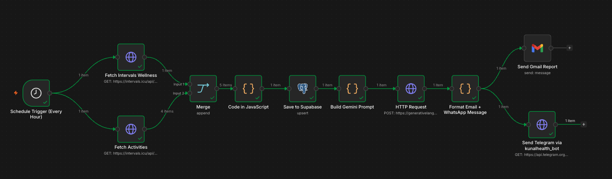

# 🏃 Kunal Health Tracker

> Fully automated personal health intelligence pipeline — from wrist to inbox, every morning, zero manual work.



## ✨ What It Does

Every morning at **9 AM**, this system automatically:

1. Fetches yesterday's complete health data from **Intervals.icu** (synced from Amazfit via Zepp)
2. Merges wellness metrics + workout activities
3. Stores everything in **Supabase** (PostgreSQL)
4. Generates a personalized AI health summary using **Google Gemini 2.5 Flash**
5. Delivers a beautifully formatted report via **Gmail** and **Telegram**

No manual exports. No uploads. Just wake up and read your report.

---

## 📊 Data Collected Daily

| Category | Metrics |
|---|---|
| Activity | Steps, Calories, Distance |
| Heart | Resting HR, HRV (RMSSD), Avg Workout HR |
| Sleep | Total hours, Sleep score, Sleep quality |
| Body | Weight |
| Training | ATL (Acute Training Load), Training load |
| Workouts | Session names, Count, Avg heart rate |

---

## 🏗️ Architecture

```
Amazfit Helio Strap
        ↓ (BLE auto-sync)
     Zepp App
        ↓ (OAuth)
   Intervals.icu
        ↓ (REST API)
       n8n (9 AM daily)
    ↙              ↘
Wellness API    Activities API
    ↘              ↙
       Merge (Append)
            ↓
     Code Node (JS)
     Field mapping + aggregation
            ↓
        Supabase
    daily_health_metrics
            ↓
    Build Gemini Prompt
            ↓
    Gemini 2.5 Flash API
            ↓
   Format Email + Message
        ↓           ↓
    Gmail        Telegram
  HTML Report   Text Summary
```

---

## 🛠️ Tech Stack

| Layer | Tool | Why |
|---|---|---|
| Wearable | Amazfit Helio Strap | HR, HRV, sleep, steps tracking |
| Mobile | Zepp (Huami) | Device sync + data aggregation |
| Health API | Intervals.icu | Reliable REST API with Zepp OAuth integration |
| Automation | n8n (self-hosted v2.22.5) | Workflow orchestration |
| Database | Supabase (PostgreSQL) | Historical data + upsert on date |
| AI | Google Gemini 2.5 Flash | Personalized health insights |
| Email | Gmail API (OAuth2) | HTML report delivery |
| Messaging | Telegram Bot API | Daily summary delivery |

---

## 🚀 Quick Start

See [docs/SETUP.md](docs/SETUP.md) for the complete step-by-step setup guide.

**Prerequisites:**
- Amazfit wearable device + Zepp app
- Intervals.icu account (free)
- n8n instance (self-hosted or cloud)
- Supabase project (free tier works)
- Google Gemini API key (free tier works)
- Gmail account
- Telegram account

---

## 📁 Repository Structure

```
kunal-health-tracker/
├── README.md
├── .env.example
├── .gitignore
├── docs/
│   ├── SETUP.md
│   ├── TROUBLESHOOTING.md
│   ├── FUTURE.md
│   └── NODE_CONFIGS.md          ← full reference with readable JS
├── n8n/
│   ├── workflow.json             ← import this directly
│   └── nodes/
│       ├── 01_schedule_trigger.json
│       ├── 02_fetch_wellness.json
│       ├── 03_fetch_activities.json
│       ├── 04_merge.json
│       ├── 05_code_map_supabase.json
│       ├── 06_save_supabase.json
│       ├── 07_build_gemini_prompt.json
│       ├── 08_gemini_api.json
│       ├── 09_format_email_telegram.json
│       ├── 10_send_gmail.json
│       └── 11_send_telegram.json
├── supabase/
│   ├── schema.sql
│   └── extend_schema.sql
└── scripts/
    └── test_intervals_api.sh
```

---

## 📸 Sample Output

### Gmail Report
- 9-metric card grid (Steps, Calories, HR, HRV, Sleep, Score, Workouts, Avg HR, Weight)
- Workout session list
- Full Gemini AI health summary

### Telegram Message
```
🏃 Health Report — 2026-05-29

👟 Steps: 3795
🔥 Calories: 660 kcal
❤️ Resting HR: 59 bpm
🧠 HRV: 52.0 ms
💤 Sleep: 9.6h (Score: 82/100)
🏋️ Workouts: 4 sessions

1. 🌅 OVERALL STATUS: You had an incredibly active day...
2. 💪 WHAT'S GOOD: Your 9.6 hours of sleep...
3. ⚠️ WATCH OUT: Your steps of 3795 are low...
4. 🎯 ACTION FOR TODAY: Add short walks...
5. 💤 SLEEP INSIGHT: Score 82/100 is excellent...
```

---

## 🔑 Environment Variables

```env
INTERVALS_ATHLETE_ID=i598416
INTERVALS_API_KEY=your_intervals_api_key
GEMINI_API_KEY=your_gemini_api_key
SUPABASE_URL=your_supabase_project_url
SUPABASE_ANON_KEY=your_supabase_anon_key
TELEGRAM_BOT_TOKEN=your_telegram_bot_token
TELEGRAM_CHAT_ID=your_telegram_chat_id
GMAIL_RECIPIENT=your@gmail.com
```

---

## 📅 Built

Built on May 30, 2026 in a single session — from idea to fully automated production pipeline.

---

## 📚 Resources & References

| Resource | Link |
|---|---|
| Claude Sonnet 4.5 (Max Thinking) | AI assistant used for architecture & code generation |
| Gemini Flash 2.5 | AI model used for daily health summaries |
| DeepSeek | AI assistant used for development |
| OpenCode | AI coding agent used in this session |
| n8n (Railway) | [Workflow instance](https://n8n-production-cce6.up.railway.app/workflow/X6OL2uCe4rK8lfXN?projectId=zFkf00iJh2CBVUO7) |
| Railway Project | [Project dashboard](https://railway.com/project/2ce5c999-9d3f-45ea-b33c-a63efe842530?environmentId=3d430453-b64e-4943-a800-7737bb9da326) |
| Railway Service | [n8n service](https://railway.com/project/2ce5c999-9d3f-45ea-b33c-a63efe842530/service/8942f69e-cb4b-4aaa-9356-28a479bc5b93?environmentId=3d430453-b64e-4943-a800-7737bb9da326) |
| Intervals.icu | [Health data dashboard](https://intervals.icu/?w=2026-06-01) |
| Supabase | [Database dashboard](https://supabase.com/dashboard/project/waqlzcaizlusjnyrrxqw/sql/6dd3cf93-751f-432d-b866-8749f0b8c788) |
| Telegram Bot API | [Bot updates](https://api.telegram.org/bot8977658056:AAGG0fKLdsLNn1ofaUyVHB865qR_bbEJz9w/getUpdates) |
| Google AI Studio | [Rate limits (28-day)](https://aistudio.google.com/rate-limit?timeRange=last-28-days&project=gen-lang-client-0284654041) |
| Google AI Studio | [Rate limits (1-day)](https://aistudio.google.com/rate-limit?timeRange=last-1-day) |
| Google Cloud Console | [OAuth clients](https://console.cloud.google.com/auth/clients?project=kunal-health-tracker) |
| Zapier | [Sample data](https://zapier.com/editor/366028196/published/_GEN_1779862103036/sample) |

---

## 📄 License

License MIT  

---

*Amazfit Helio Strap → Zepp → Intervals.icu → n8n → Supabase → Gemini → Gmail + Telegram*
